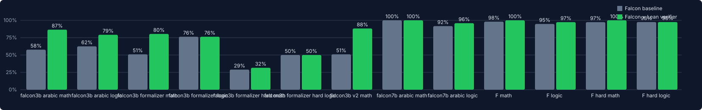

# Benchmark results

Generated by `python bench/report.py` from `bench/results/*/run_*/results.json`.

## falcon3b_arabic — `run_20260924T211538Z`

student `falcon-h1-arabic-3b-instruct` · formalizer `falcon-h1-arabic-34b-instruct` · max rounds 3 · wall 446s · errors 0

| metric | all | math | logic | hard | fragment | eastern-digits |
|---|---|---|---|---|---|---|
| problems | 76 | 52 | 24 | 6 | 16 | 28 |
| baseline acc | 59.2% | 55.8% | 66.7% | 50.0% | 68.8% | 53.6% |
| verified acc | 80.3% | 86.5% | 66.7% | 83.3% | 87.5% | 82.1% |
| abs gain | 21.1% | 30.8% | 0.0% | 33.3% | 18.8% | 28.6% |
| rel. error ↓ | 51.6% | 69.6% | 0.0% | 66.7% | 60.0% | 61.5% |
| wrong (baseline) | 31 | 23 | 8 | 3 | 5 | 13 |
| caught by Lean | 22 | 22 | 0 | 3 | 5 | 12 |
| detection recall | 71.0% | 95.7% | 0.0% | 100.0% | 100.0% | 92.3% |
| fixed after feedback | 16 | 16 | 0 | 2 | 3 | 8 |
| fix rate | 51.6% | 69.6% | 0.0% | 66.7% | 60.0% | 61.5% |
| false alarms | 1 | 1 | 0 | 0 | 0 | 0 |
| false-alarm rate | 2.2% | 3.5% | 0.0% | 0.0% | 0.0% | 0.0% |
| regressions | 0 | 0 | 0 | 0 | 0 | 0 |
| assured ∧ correct | 53 | 44 | 9 | 5 | 14 | 23 |
| mean rounds | 1.53 | 1.77 | 1.0 | 1.83 | 1.62 | 1.75 |
| mean latency (s) | 33.5 | 38.5 | 22.6 | 47.5 | 20.3 | 37.0 |

Problems Falcon got wrong at baseline

| id | expected | baseline | final | Lean flagged r1 | status |
|---|---|---|---|---|---|
| armath-009 | 1029 | 1485 | 1029 | yes | verified |
| armath-011 | 1229 | 1169 | 1229 | yes | verified |
| armath-012 | 977 | 997 | 977 | yes | verified |
| armath-007 | 2212 | 2192 | 2192 | yes | max_rounds |
| armath-010 | 689 | 775 | 650 | yes | max_rounds |
| armath-019 | 2291 | 187 تمرة | 2291 تمرة | yes | verified |
| armath-022 | 1311 | 933 كرسياً | 1311 كرسيًا | yes | verified |
| armath-021 | 3242 | 1882 | 3242 | yes | verified |
| armath-017 | 1368 | 48 | 48 | yes | max_rounds |
| armath-018 | 3375 | 305 | None | yes | verified |
| armath-027 | 300 | 200 درهماً | 300 درهماً | yes | verified |
| armath-029 | 80 | 81.5 | 80 | yes | verified |
| armath-028 | 58 | 62.4 | 58.0 | yes | verified |
| armath-031 | 77 | 78.5 | 77 | yes | verified |
| armath-020 | 2924 | 156 | 2924 | yes | verified |
| armath-030 | 71 | متوسط درجات ليلى هو 69.4 | متوسط درجات ليلى هو 69.4 | yes | max_rounds |
| armath-045 | 172 | 12 درهماً | 12 درهماً | no | unknown |
| armath-043 | 152 | 10 دراهم | 152 درهماً | yes | verified |
| armath-046 | 134 | 24 درهماً | 134 درهماً | yes | verified |
| armath-051 | 133 | 863 | 133 | yes | verified |
| armath-044 | 118 | 14 درهماً | 118 درهماً | yes | verified |
| arlogic-003 | نعم | لا | لا | no | verified |
| armath-050 | 99 | 75 | 99 | yes | verified |
| arlogic-006 | لا | None | None | no | verified |
| arlogic-009 | لا | None | None | no | verified |
| arlogic-008 | نعم | لا، لا يلزم | لا، لا يلزم | no | unknown |
| arlogic-010 | نعم | None | None | no | unknown |
| arlogic-013 | نعم | None | None | no | verified |
| arlogic-014 | لا | None | None | no | unknown |
| armath-052 | 57 | 79 | 79 | yes | max_rounds |
| arlogic-016 | نعم | لا | لا | no | verified |

## falcon3b_formalizer — `run_20260924T204815Z`

student `falcon-h1-arabic-3b-instruct` · formalizer `falcon-h1-arabic-34b-instruct` · max rounds 3 · wall 611s · errors 0

| metric | all | math | logic |
|---|---|---|---|
| problems | 89 | 51 | 38 |
| baseline acc | 61.8% | 51.0% | 76.3% |
| verified acc | 78.6% | 80.4% | 76.3% |
| abs gain | 16.9% | 29.4% | 0.0% |
| rel. error ↓ | 44.1% | 60.0% | 0.0% |
| wrong (baseline) | 34 | 25 | 9 |
| caught by Lean | 26 | 23 | 3 |
| detection recall | 76.5% | 92.0% | 33.3% |
| fixed after feedback | 15 | 15 | 0 |
| fix rate | 44.1% | 60.0% | 0.0% |
| false alarms | 3 | 0 | 3 |
| false-alarm rate | 5.5% | 0.0% | 10.3% |
| regressions | 0 | 0 | 0 |
| assured ∧ correct | 61 | 40 | 21 |
| mean rounds | 1.61 | 1.82 | 1.32 |
| mean latency (s) | 39.4 | 36.0 | 43.8 |

Problems Falcon got wrong at baseline

| id | expected | baseline | final | Lean flagged r1 | status |
|---|---|---|---|---|---|
| math-002 | 1157 | 1425 | 1157 | yes | verified |
| math-004 | 2405 | 1538 | 2405 | yes | verified |
| math-001 | 731 | 1103 | 731 | yes | verified |
| math-003 | 3414 | 3634 | 3634 | yes | max_rounds |
| math-010 | 343 | 340 kg | 343 kg | yes | verified |
| math-030 | 148.5 | 132 | 132 | no | unknown |
| math-026 | 4 | 8 | 4 | yes | verified |
| math-027 | 10 | 44 | 2 | yes | max_rounds |
| math-025 | 1 | 3 | 24 | yes | max_rounds |
| math-029 | 180 | 165 | 180 | yes | verified |
| math-028 | 9 | 2 | 10 | yes | max_rounds |
| math-031 | 432.25 | 368 | 432.25 | yes | verified |
| math-036 | 11 | 21 | 21 | no | unknown |
| math-034 | 7 | 17 | 17 | yes | verified |
| math-032 | 167.75 | 133 | 167.75 | yes | verified |
| math-037 | 18 | 21 | 21 | yes | verified |
| math-042 | 252 | 10 | 10 | yes | verified |
| math-043 | 392 | 144 dirhams | 392 dirhams | yes | verified |
| math-041 | 180 | 100 | 180 | yes | verified |
| math-044 | 428 | 10 dirhams | 428 | yes | verified |
| math-045 | 340 | 26 | 340 | yes | verified |
| math-046 | 930 | 960 | 869 | yes | max_rounds |
| math-047 | 342 | 360 | 342 | yes | verified |
| math-048 | 240 | 0 | 240 | yes | verified |
| logic-006 | Yes | No | No | no | verified |
| math-050 | 195 | 90 litres | 195 لترًا | yes | verified |
| logic-003 | Yes | No | No | yes | max_rounds |
| logic-021 | Yes | No | No | no | verified |
| logic-005 | Yes | No | No | yes | max_rounds |
| logic-023 | Yes | No | No | no | verified |
| logic-033 | No | Yes | Yes | no | unknown |
| logic-037 | No | Yes | Yes | no | unknown |
| logic-027 | Yes | No | No | yes | max_rounds |
| logic-038 | Yes | No | No | no | verified |

## falcon3b_formalizer_hard — `run_20260924T203117Z`

student `falcon-h1-arabic-3b-instruct` · formalizer `falcon-h1-arabic-34b-instruct` · max rounds 3 · wall 750s · errors 0

| metric | all | math | logic |
|---|---|---|---|
| problems | 78 | 38 | 40 |
| baseline acc | 39.7% | 28.9% | 50.0% |
| verified acc | 41.0% | 31.6% | 50.0% |
| abs gain | 1.3% | 2.6% | 0.0% |
| rel. error ↓ | 2.1% | 3.7% | 0.0% |
| wrong (baseline) | 47 | 27 | 20 |
| caught by Lean | 19 | 18 | 1 |
| detection recall | 40.4% | 66.7% | 5.0% |
| fixed after feedback | 1 | 1 | 0 |
| fix rate | 2.1% | 3.7% | 0.0% |
| false alarms | 0 | 0 | 0 |
| false-alarm rate | 0.0% | 0.0% | 0.0% |
| regressions | 0 | 0 | 0 |
| assured ∧ correct | 21 | 12 | 9 |
| mean rounds | 1.36 | 1.71 | 1.02 |
| mean latency (s) | 37.8 | 42.5 | 33.3 |

Problems Falcon got wrong at baseline

| id | expected | baseline | final | Lean flagged r1 | status |
|---|---|---|---|---|---|
| hmath-006 | 83328 | 83088 | 83088 | yes | verified |
| hmath-002 | 237606 | 230466 | 234820 | yes | unknown |
| hmath-007 | 13680 | 12880 | 12880 | no | unknown |
| hmath-004 | 271313 | 272753 | 272753 | yes | max_rounds |
| hmath-005 | 152607 | 153927 | 152607 | yes | verified |
| hmath-008 | 12299 | 12709 | 12709 | yes | verified |
| hmath-010 | 14158 | 12658 | 12658 | yes | verified |
| hmath-011 | 722 | 755 | 755 | no | unknown |
| hmath-014 | 1020 | 1133 | 1133 | no | unknown |
| hmath-012 | 1710 | 1255 | 1255 | yes | verified |
| hmath-009 | 9042 | 7962 | 7962 | yes | max_rounds |
| hmath-016 | 1728 | 1920 | 1920 | yes | verified |
| hmath-017 | 1012.5 | 1125 | 1125 | no | unknown |
| hmath-015 | 612 | 693 | 693 | yes | verified |
| hmath-018 | 1920 | 2400 | 2400 | yes | verified |
| hmath-019 | 80 | 96 | 109.2 | yes | max_rounds |
| hmath-023 | 2 | 27 | 27 | yes | max_rounds |
| hmath-024 | 13 | 25 | 77 | yes | unknown |
| hmath-027 | 14 | 13 | 13 | no | unknown |
| hmath-026 | 5 | 20 | 15 | yes | verified |
| hmath-028 | 38 | 37 | 37 | no | unknown |
| hmath-020 | 76 | 75.8 | 75.8 | yes | max_rounds |
| hmath-029 | 36 | 35 | 35 | no | unknown |
| hmath-025 | 11 | 24 | 24 | yes | max_rounds |
| hmath-034 | 102 | 885 | 885 | no | unknown |
| hmath-037 | 10000 | The area \( A \) of the rectangle is calculated using the formula: | The area \( A \) of the rectangle is calculated using the formula: | no | unknown |
| hmath-035 | 144 | 195 | 195 | yes | verified |
| hlogic-002 | No | Yes | Yes | no | unknown |
| hlogic-005 | No | نعم، النتيجة تتبع الضرورة من المقدمات | نعم، النتيجة تتبع الضرورة من المقدمات | no | verified |
| hlogic-006 | Yes | نعم | نعم | no | verified |
| hlogic-003 | Yes | No | No | no | verified |
| hlogic-008 | Yes | No | No | yes | unknown |
| hlogic-010 | Yes | No | No | no | unknown |
| hlogic-014 | Yes | No | No | no | unknown |
| hlogic-013 | Yes | No | No | no | unknown |
| hlogic-018 | Yes | No | No | no | verified |
| hlogic-019 | Yes | No | No | no | unknown |
| hlogic-021 | Yes | No | No | no | unknown |
| hlogic-022 | Yes | No | No | no | unknown |
| hlogic-025 | No | Yes | Yes | no | unknown |
| hlogic-024 | Yes | No | No | no | unknown |
| hlogic-020 | Yes | No | No | no | verified |
| hlogic-026 | Yes | No | No | no | unknown |
| hlogic-031 | Yes | No | No | no | unknown |
| hlogic-034 | Yes | نعم، النتيجة تتبع الضروريات بشكل منطقي | نعم، النتيجة تتبع الضروريات بشكل منطقي | no | verified |
| hlogic-035 | Yes | No | No | no | unknown |
| hlogic-033 | No | نعم، الاستنتاج يتبع الضرورة من المقدمات | نعم، الاستنتاج يتبع الضرورة من المقدمات | no | unknown |

## falcon3b_v2 — `run_20260924T203637Z`

student `falcon-h1-arabic-3b-instruct` · formalizer `falcon-h1-arabic-34b-instruct` · max rounds 3 · wall 349s · errors 0

| metric | all | math |
|---|---|---|
| problems | 51 | 51 |
| baseline acc | 51.0% | 51.0% |
| verified acc | 88.2% | 88.2% |
| abs gain | 37.2% | 37.2% |
| rel. error ↓ | 76.0% | 76.0% |
| wrong (baseline) | 25 | 25 |
| caught by Lean | 23 | 23 |
| detection recall | 92.0% | 92.0% |
| fixed after feedback | 19 | 19 |
| fix rate | 76.0% | 76.0% |
| false alarms | 0 | 0 |
| false-alarm rate | 0.0% | 0.0% |
| regressions | 0 | 0 |
| assured ∧ correct | 44 | 44 |
| mean rounds | 1.82 | 1.82 |
| mean latency (s) | 39.3 | 39.3 |

Problems Falcon got wrong at baseline

| id | expected | baseline | final | Lean flagged r1 | status |
|---|---|---|---|---|---|
| math-008 | 669 | 108 kg | 108 kg | no | unknown |
| math-001 | 731 | 1103 | 731 | yes | verified |
| math-006 | 2568 | 2400 - 88 = 2312. Fatima has 2312 boxes left | 2568 | yes | verified |
| math-003 | 3414 | 2838 | 3414 | yes | verified |
| math-002 | 1157 | 1105 | 1157 | yes | verified |
| math-011 | 622 | 108 kg | 622 kg | yes | verified |
| math-010 | 343 | 121 kg | 343 kg | yes | verified |
| math-030 | 148.5 | 132 | 132 | no | unknown |
| math-025 | 1 | 3 | 1 | yes | verified |
| math-026 | 4 | 8 | 8 | yes | max_rounds |
| math-027 | 10 | 44 | 10 | yes | verified |
| math-028 | 9 | 3 | 9 | yes | verified |
| math-029 | 180 | 160 | 180 | yes | verified |
| math-031 | 432.25 | 368 | 432.25 | yes | verified |
| math-037 | 18 | 21 | 21 | yes | verified |
| math-035 | 10 | 11 | 10 | yes | verified |
| math-032 | 167.75 | 133 | 167.75 | yes | verified |
| math-042 | 252 | 10 | 10 | yes | verified |
| math-044 | 428 | 12 | 12 | yes | verified |
| math-041 | 180 | 20 | 180 | yes | verified |
| math-043 | 392 | 144 dirhams | 392 dirhams | yes | verified |
| math-045 | 340 | 26 | 340 | yes | verified |
| math-047 | 342 | 360 | 342 | yes | verified |
| math-046 | 930 | 960 | 930 | yes | verified |
| math-048 | 240 | 0 | 240 | yes | verified |

## falcon7b_arabic — `run_20260924T210958Z`

student `falcon-h1-7b-instruct` · formalizer `falcon-h1-arabic-34b-instruct` · max rounds 3 · wall 306s · errors 0

| metric | all | math | logic | hard | fragment | eastern-digits |
|---|---|---|---|---|---|---|
| problems | 76 | 52 | 24 | 6 | 16 | 28 |
| baseline acc | 97.4% | 100.0% | 91.7% | 100.0% | 100.0% | 100.0% |
| verified acc | 98.7% | 100.0% | 95.8% | 100.0% | 100.0% | 100.0% |
| abs gain | 1.3% | 0.0% | 4.2% | 0.0% | 0.0% | 0.0% |
| rel. error ↓ | 50.0% | 0.0% | 50.0% | 0.0% | 0.0% | 0.0% |
| wrong (baseline) | 2 | 0 | 2 | 0 | 0 | 0 |
| caught by Lean | 1 | 0 | 1 | 0 | 0 | 0 |
| detection recall | 50.0% | – | 50.0% | – | – | – |
| fixed after feedback | 1 | 0 | 1 | 0 | 0 | 0 |
| fix rate | 50.0% | – | 50.0% | – | – | – |
| false alarms | 1 | 0 | 1 | 0 | 0 | 0 |
| false-alarm rate | 1.4% | 0.0% | 4.5% | 0.0% | 0.0% | 0.0% |
| regressions | 0 | 0 | 0 | 0 | 0 | 0 |
| assured ∧ correct | 66 | 52 | 14 | 6 | 16 | 28 |
| mean rounds | 1.04 | 1.0 | 1.12 | 1.0 | 1.0 | 1.0 |
| mean latency (s) | 22.9 | 18.3 | 33.0 | 23.1 | 16.0 | 18.9 |

Problems Falcon got wrong at baseline

| id | expected | baseline | final | Lean flagged r1 | status |
|---|---|---|---|---|---|
| arlogic-014 | لا | نعم | نعم | no | unknown |
| arlogic-002 | لا | نعم | لا | yes | verified |

## falcon_formalizer — `run_20260924T195449Z`

student `falcon-h1-7b-instruct` · formalizer `falcon-h1-arabic-34b-instruct` · max rounds 3 · wall 624s · errors 0

| metric | all | math | logic |
|---|---|---|---|
| problems | 89 | 51 | 38 |
| baseline acc | 96.6% | 98.0% | 94.7% |
| verified acc | 98.9% | 100.0% | 97.4% |
| abs gain | 2.2% | 2.0% | 2.6% |
| rel. error ↓ | 66.7% | 100.0% | 50.0% |
| wrong (baseline) | 3 | 1 | 2 |
| caught by Lean | 2 | 1 | 1 |
| detection recall | 66.7% | 100.0% | 50.0% |
| fixed after feedback | 2 | 1 | 1 |
| fix rate | 66.7% | 100.0% | 50.0% |
| false alarms | 3 | 3 | 0 |
| false-alarm rate | 3.5% | 6.0% | 0.0% |
| regressions | 0 | 0 | 0 |
| assured ∧ correct | 75 | 44 | 31 |
| mean rounds | 1.09 | 1.14 | 1.03 |
| mean latency (s) | 27.6 | 25.6 | 30.3 |

Problems Falcon got wrong at baseline

| id | expected | baseline | final | Lean flagged r1 | status |
|---|---|---|---|---|---|
| math-031 | 432.25 | 431.75 km | 432.25 km | yes | verified |
| logic-027 | Yes | No | No | no | unknown |
| logic-024 | No | Yes | No | yes | verified |

## falcon_formalizer_hard — `run_20260924T201013Z`

student `falcon-h1-7b-instruct` · formalizer `falcon-h1-arabic-34b-instruct` · max rounds 3 · wall 668s · errors 0

| metric | all | math | logic |
|---|---|---|---|
| problems | 78 | 38 | 40 |
| baseline acc | 97.4% | 97.4% | 97.5% |
| verified acc | 98.7% | 100.0% | 97.5% |
| abs gain | 1.3% | 2.6% | 0.0% |
| rel. error ↓ | 50.0% | 100.0% | 0.0% |
| wrong (baseline) | 2 | 1 | 1 |
| caught by Lean | 1 | 1 | 0 |
| detection recall | 50.0% | 100.0% | 0.0% |
| fixed after feedback | 1 | 1 | 0 |
| fix rate | 50.0% | 100.0% | 0.0% |
| false alarms | 2 | 2 | 0 |
| false-alarm rate | 2.6% | 5.4% | 0.0% |
| regressions | 0 | 0 | 0 |
| assured ∧ correct | 55 | 33 | 22 |
| mean rounds | 1.06 | 1.13 | 1.0 |
| mean latency (s) | 33.0 | 28.9 | 37.0 |

Problems Falcon got wrong at baseline

| id | expected | baseline | final | Lean flagged r1 | status |
|---|---|---|---|---|---|
| hmath-023 | 2 | 12 | 2 | yes | verified |
| hlogic-008 | Yes | No | No | no | unknown |

